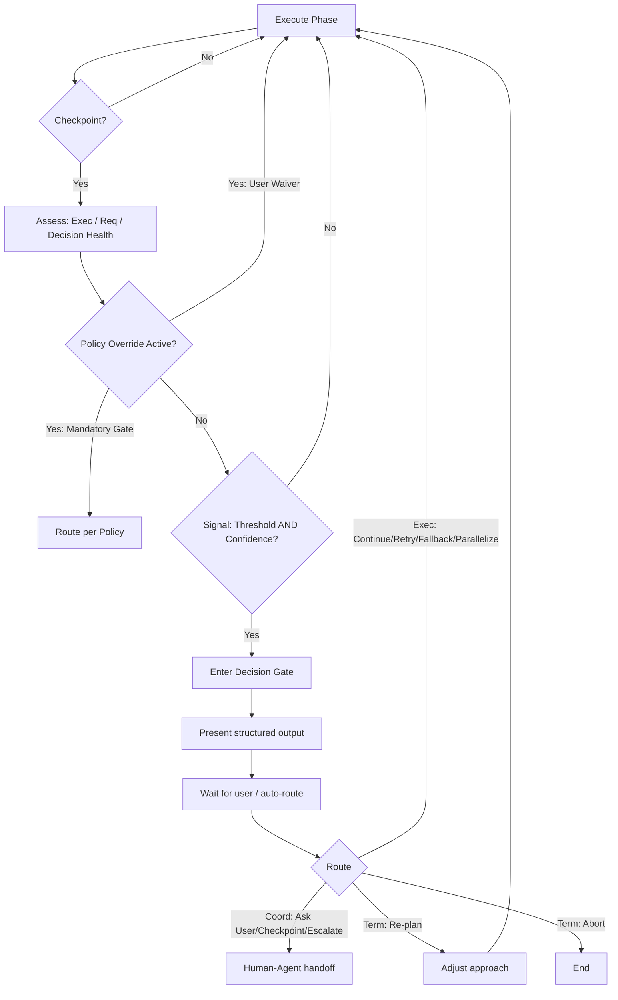

# Decision Gate

## Core Principle

The Decision Gate is a runtime routing system powered by a three-layer architecture.

During execution, the agent continuously evaluates health across three dimensions.
When a signal passes its threshold and confidence bar, the Trigger Engine proposes
a route — but Decision Policy has the final say. Policy can override, suppress, or
mandate routing regardless of health signals.

Re-plan is one possible output. It belongs to the Termination category.
It is not the goal.

---

## Architecture

```
                User Policy
                     |
                     v
            Decision Policy Layer
                     |
         +-----------+-----------+
         |                       |
         v                       v
  Mandatory Rules          Runtime Assessment
  (always enforced)              |
                                 v
                         Health Assessment
                                 |
                                 v
                          Trigger Engine
                                 |
                                 v
                          Route Decision
```

### Gate Outputs: Three Categories

The nine gate outputs are organized into three functional categories.

#### Category 1: Execution Actions

The agent can decide these autonomously. No user interaction needed.

| Output | When |
|---|---|
| Continue | All health dimensions nominal, no policy flags |
| Retry | Transient failure, high recovery confidence, within retry budget |
| Fallback | Primary approach blocked, viable degraded path available |
| Parallelize | Independent sub-tasks identified, concurrency safe |

#### Category 2: Coordination

Requires human-agent collaboration. Agent proposes; human approves or redirects.

| Output | When |
|---|---|
| Ask User | Multiple viable paths, user preference matters, or ambiguous tradeoff |
| Checkpoint | Progress should be saved before a risky or irreversible phase |
| Escalate | Problem exceeds agent capability, requires human domain judgment |

#### Category 3: Termination

Stop the current execution track. Either adjust and restart, or end.

| Output | When |
|---|---|
| Re-plan | Strategy is viable but needs structural adjustment before continuing |
| Abort | Cost exceeds value, risk unacceptable, or goal unreachable |

---

## The Three-Layer Model

### Layer 1: Decision Policy (Governance Layer)

Decision Policy is the governing layer. It wraps around the entire system
and can override, mandate, or redirect routing regardless of health signals.

Override Rules:

| Rule | Effect |
|---|---|
| User said "do everything, don't ask" | Suppress health signals unless risk is critical |
| Destructive operation ahead | Force gate even with zero health signals |
| Operation is irreversible | Require explicit confirmation |
| User unavailable (async/batch) | Route to safest path, never Abort silently |
| Hard deadline specified | Escalate if deadline will be breached |

Key insight: Policy can produce gate routing even when the Trigger Engine
sees zero health signals. A DROP TABLE command has Threshold 0 and Confidence
100% — the Engine would see no trigger. Policy overrides this to Escalate.

Priority: Decision Policy > Health Assessment > Trigger Engine. Always.

### Layer 2: Three Health Dimensions

Health signals are organized by category — not a flat list.

#### Execution Health

The agent's operational efficiency.

| Signal | Threshold | Confidence Factor |
|---|---|---|
| Failure rate rising | > 50% (last 10 ops) | HIGH if same error type; LOW if varied |
| Time per unit increasing | > 3x initial speed | HIGH if structural; LOW if one slow item |
| Cost exceeding estimate | > 3x original estimate | HIGH if data-driven; LOW if guesswork |
| Speed degrading | > 2x slowdown sustained | HIGH if monotonic trend; LOW if spike |

#### Requirement Health

The stability of what is being asked.

| Signal | Threshold | Confidence Factor |
|---|---|---|
| Scope expanding mid-execution | >= 2 new task categories | HIGH if user-initiated; MED if agent-discovered |
| Unknown unknowns growing | Unknown steps > known steps | HIGH if new domain; MED if same domain deeper |
| Manual judgment replacing automation | >= 3 judgment calls without user input | HIGH if domain gap; MED if formatting choice |

#### Decision Health

The quality of the next-step options.

| Signal | Threshold | Confidence Factor |
|---|---|---|
| Multiple viable paths exist | >= 2 approaches, each > 10 min | HIGH if tradeoffs clear; MED if one path dominates |
| Path is irreversible | Destructive or schema-changing operation | HIGH always (mandatory gate) |
| User preference required | Time vs. quality vs. completeness tradeoff | HIGH if preferences unknown; LOW if implied by task |

### Layer 3: Trigger Decision = f(Threshold, Confidence, Policy)

The Trigger Engine assesses health signals. The full decision function is:

```
TRIGGER_DECISION = f(Threshold, Confidence, Policy)
```

A health signal contributes to routing only when:

```
(THRESHOLD reached) AND (CONFIDENCE >= MEDIUM)
```

But Policy can override at any point.

Why the three-input model matters:

| Scenario | Threshold | Confidence | Policy | Result |
|---|---|---|---|---|
| 3 API 404s, known outage | MET | HIGH | Neutral | Re-plan |
| 3 random 404s | MET | LOW | Neutral | Suppress |
| DROP TABLE command | 0 | 100% | Mandatory gate | Escalate |
| User said "always retry" | MET | HIGH | Override | Retry |

The Trigger Engine proposes. Decision Policy disposes.

Confidence assessment criteria:

| Confidence | Criteria |
|---|---|
| HIGH | Pattern is systematic, root cause identifiable, trend monotonic |
| MEDIUM | Pattern emerging but noisy, root cause plausible but unconfirmed |
| LOW | Pattern could be noise, root cause speculative, alternatives exist |

---

## Decision Flow



---

## Structured Output Format

When the Decision Gate fires, produce:

### 1. Progress Summary
- Original goal
- Completed (quantified)
- Failed (categorized by error type)

### 2. Health Assessment
- Which health dimension(s) flagged, with threshold and confidence
- Root cause: systematic or incidental?

### 3. Gate Routing
- Category: Execution Action / Coordination / Termination
- Recommended gate output with rationale
- 2-4 concrete paths, each with: What / Effort / Completeness / Risk
- Policy applied (if any)

### 4. Decision
- State recommendation, defer to user

---

## What Does NOT Fire the Gate

- A single timeout, 404, or transient error
- One malformed data item
- The first retry
- Tasks explicitly marked "complete everything, don't ask"
- Expected repetitive work
- Normal data cleaning

---

## Anti-Patterns

DO NOT:
- Gate after every minor hiccup
- Gate without quantified evidence
- Present "continue" as the only option
- Treat "user said do everything" as permanent waiver
- Confuse "task is hard" with "task needs gating"

---

## Examples

### Example 1: Coordination — Ask User

Task: Scrape contact info from 50 university websites.

Progress: 12/50 done (2 min each). Remaining 38 use React SPAs (10-15 min each).

Health: Execution Health — time per unit > 3x, confidence HIGH.
Policy: No override active.

Gate route -> Coordination: Ask User:
A. Continue all 50 — 6-10h, 100%
B. Prioritize top 20 — ~2h, 80%
C. Deliver 12 now — 0h, 24%

### Example 2: Coordination — Ask User (Multiple Paths)

Task: Fix the CI pipeline.

Progress: Fixed lint. Tests reveal 14 failures (snapshot drift, dependency mismatch, env config).

Health: Decision Health — multiple paths, confidence HIGH.

Gate route -> Coordination: Ask User:
A. Fix all — 1-3h, high uncertainty
B. Fix snapshot + config — 1h
C. Roll back to green — 30 min

### Example 3: Policy Override — Escalate

Task: Clean up the database.

Progress: Agent identifies a DROP TABLE command.

Health: Zero health signals. Threshold 0, Confidence 100%.

Policy: Mandatory gate for destructive operations.

Gate route -> Coordination: Escalate. Require explicit user confirmation.

---

## Edge Cases

### User says "just keep going"
Record waiver. Continue. Re-evaluate at next checkpoint — do not silence gates permanently.

### Task is time-critical
Add time remaining to every option. Flag paths that exceed the deadline.

### All options are bad
Say so. Abort is a valid gate output.

### User is unavailable
Route to safest path: prefer Execution Actions over Coordination.
Never Abort silently. Never choose irreversible without consent.

### Multiple health dimensions flag simultaneously
Report all. Present consolidated options. Do not repeat per dimension.

### Policy says one thing, health says another
Policy always wins. If policy mandates Escalate and health says Continue,
the route is Escalate. Explain why.
